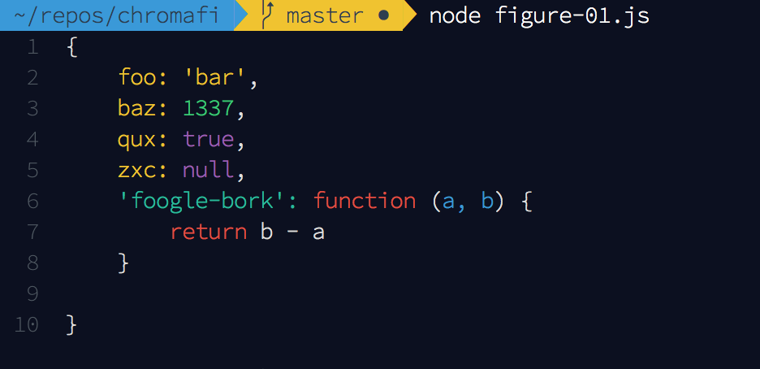
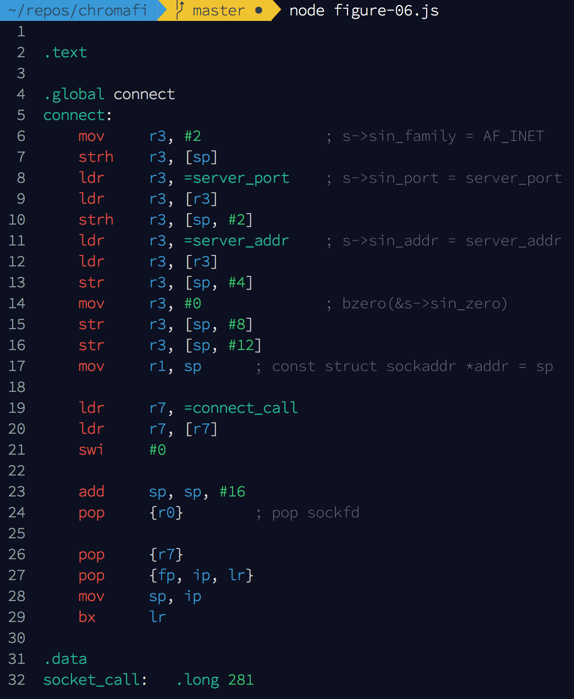

# Chromafi

> 💥 Syntax highlight to console: any lang - any fn, any - obj.

[badges]

For years, Javacripts across the web have committed monocrimes against humanity too horrible to mention. Today our long stuggle ends. with Chromafi, JavaScript objects logged to the console... still look like JavaScript objects. Oh... and you can highlight other languages too!

## Usage

### Chromafi a JavaScript Object

```javascript
const chromafi = require('chromafi')

const obj = {
    foo: 'bar',
    baz: 1337,
    qux: true,
    zxc: null,
    'foogle-bork': function (a, b) {
        return b - a
    }
}

const chromatastic = chromafi(obj)

console.log(chromatastic)
```



### Chromafi a JavaScript Function

```javascript
const chromafi = require('chromafi')

function add (a, b) {
    return a + b
}
const chromatastic = chromafi(add)

console.log(chromatastic)
```


### Chromafi a String of Code

```javascript
const chromafi = require('chromafi')

const codeString = `
// Creates a Class based on Type
const create = (kind, parent) => {
    // Create the Class based on the Type's
    // Constructor or use an Anon. Func
    const protoclass = kind.ctor || function () {}

    // Inherit from a parent object
    if (parent) {
        protoclass.prototype = new Parent()
    }

    // Merge prototype from Class's Type
    if (kind.proto) {
        merge.call(protoclass.prototype, kind.proto)
    }

    return protoclass
}
`

const chromatastic = chromafi(codeString)

console.log(chromatastic)
```


## Options

```javascript
const chromafi = require('chromafi')

const obj = {foobar: 1337}

const options = {
    lineNumberPad: 0,
    codePad: 0,
    indent: 2,
    lineNumbers: true,
    colors: {
        BASE: ['bgBlack', 'white', 'bold'],
        LINE_NUMBERS: ['bgCyan', 'black']
    }
}

const chromatastic = chromafi(obj, options)

console.log(chromatastic)

```


## Light Color Scheme

```javascript
const chromafi = require('chromafi')

const obj = {
    foo: 'bar',
    baz: 1337,
    qux: true,
    zxc: null,
    'foogle-bork': function (a, b) {
        return b - a
    }
}

const chromatastic = chromafi(obj, {
    colors: {
        BASE: ['bgWhite', 'black', 'bold'],
        KEYWORD: ['red'],
        NUMBER: ['blue', 'dim'],
        FUNCTION: ['black'],
        TITLE: ['blue'],
        PARAMS: ['black'],
        STRING: ['black'],
        BUILT_IN: ['magenta'],
        LITERAL: ['blue'],
        ATTR: ['black'],
        TRAILING_SPACE: [],
        REGEXP: ['blue'],
        LINE_NUMBERS: ['bgBlue', 'white']
    }
})

console.log(chromatastic)
```


## Logging Other Languages

Chromafi uses [`highlight.js`](https://highlightjs.org/) internally to add syntax highlighting to your code. This means that you can use any language that `highlight.js` can use.

Here is an example using Chromafi to highlight assembler syntax .

```javascript
const chromafi = require('chromafi')

const armAssemblyCode = `
.text

.global connect
connect:
    mov     r3, #2              ; s->sin_family = AF_INET
    strh    r3, [sp]
    ldr     r3, =server_port    ; s->sin_port = server_port
    ldr     r3, [r3]
    strh    r3, [sp, #2]
    ldr     r3, =server_addr    ; s->sin_addr = server_addr
    ldr     r3, [r3]
    str     r3, [sp, #4]
    mov     r3, #0              ; bzero(&s->sin_zero)
    str     r3, [sp, #8]
    str     r3, [sp, #12]
    mov     r1, sp      ; const struct sockaddr *addr = sp

    ldr     r7, =connect_call
    ldr     r7, [r7]
    swi     #0

    add     sp, sp, #16
    pop     {r0}        ; pop sockfd

    pop     {r7}
    pop     {fp, ip, lr}
    mov     sp, ip
    bx      lr

.data
socket_call:   .long 281
connect_call:  .long 283

/* all addresses are network byte-order (big-endian) */
server_addr:            .long 0x0100007f ; localhost
server_port:            .hword 0x0b1a
`

const chromalicious = chromafi(armAssemblyCode, {lang: 'arm'})

console.log(chromalicious)
```


